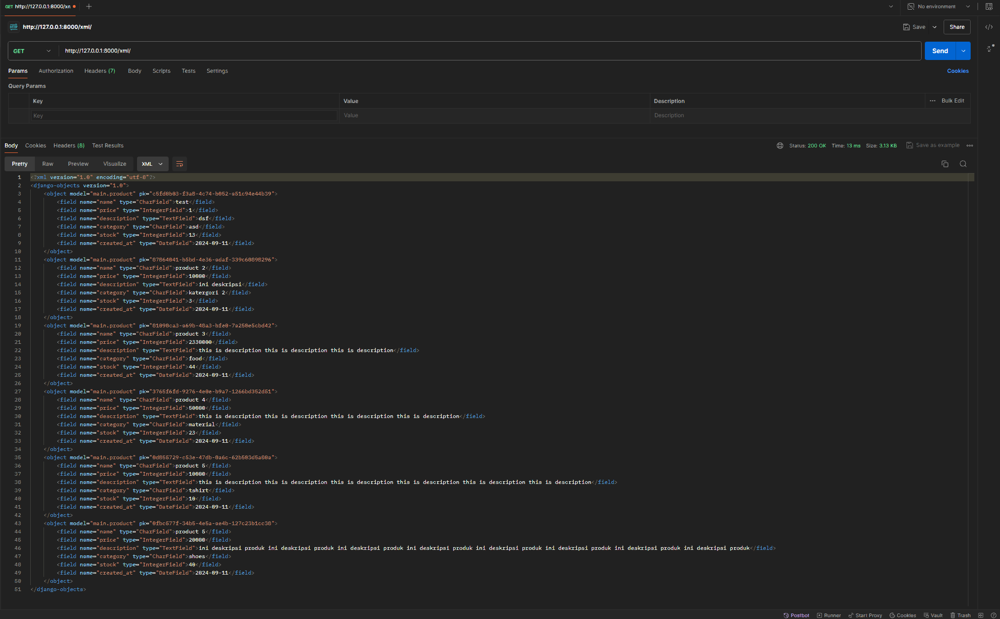
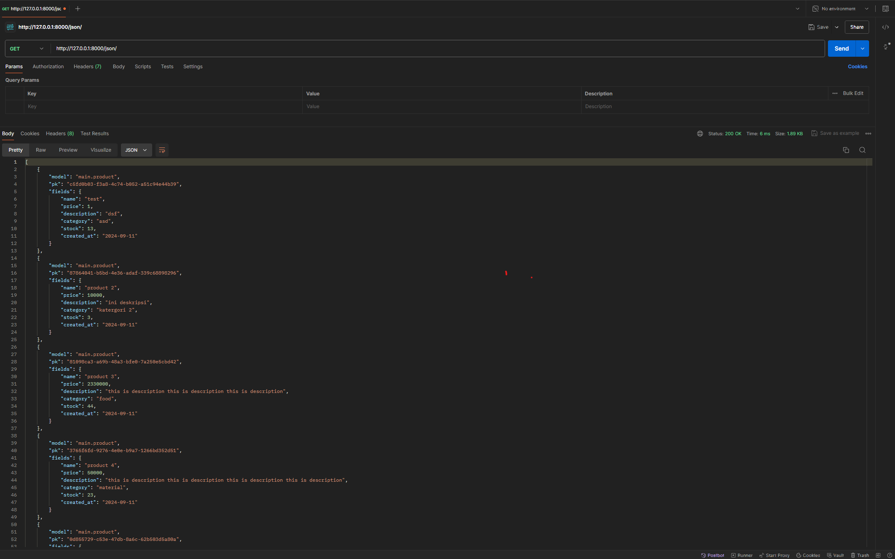
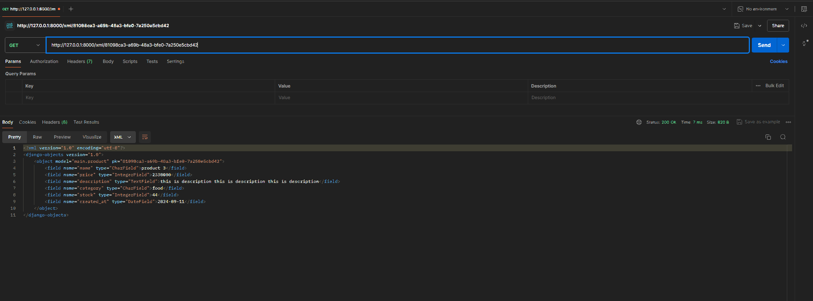
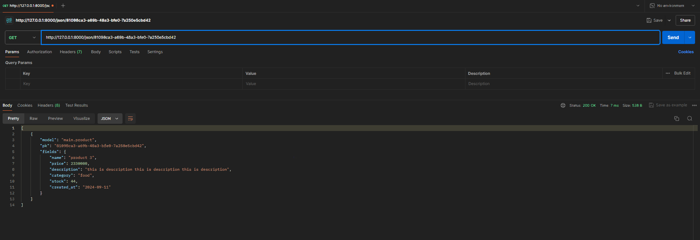

## TUGAS 2

1. Jelaskan bagaimana cara kamu mengimplementasikan checklist di atas secara step-by-step (bukan hanya sekadar mengikuti tutorial).

```
1) Setup venv untuk tugas 2 dengan perintah 'python -m venv .venv'
2) Buat file requirements.txt dan masukkan library yang ingin diinstall di venv dan buat file .gitignore
3) Buat projek django baru dengan perintah 'django-admin startproject gotoko .'
4) Buat aplikasi baru bernama main dengan perintah 'python manage.py startapp main'
5) Tambahkan main ke dalam variabel INSTALLED_APPS di settings.py di dalam direktori 'gotoko'
6) Buat model Product yang berisi atribut 'name, price, description, category, stock, created_at' di file models.py dalam direktori main
7) Buat migrasi model dan aplikasikan migrasi ke dalam basis data lokal dengan perintah 'python manage.py makemigrations' lalu 'python manage.py migrate'
8) Pada views.py dalam direktori main, tambahkan function untuk yang akan mereturn request, main.html, dan context
9) Buat folder bernama templates dalam direktori main dan buat main.html yang menampilkan nama toko, nama, dan kelas
10) Konfigurasi routing url pada direktori main dengan membuat file urls.py dan tambahkan kode yang diperlukan
11) Konfigurasi routing url pada direktori gotoko dengan menambahkan 'path('', include('main.urls'))'
12) Jalankan program dengan perintah 'python manage.py runserver'
```

2. Buatlah bagan yang berisi request client ke web aplikasi berbasis Django beserta responnya dan jelaskan pada bagan tersebut kaitan antara urls.py, views.py, models.py, dan berkas html.

```
Client HTTP Request (Browser) ----> URLs (urls.py) ----> Django Views (views.py) ----> Django Models (models.py) <----> Database
                                   |
                                   v
                            Django Templates (HTML)
                                   |
                                   v
Back to Client   <----   Response (HTML Content)

Django merupakan framework yang menggunakan struktur MVT atau Model-Views-Template. Model merupakan sebuah objek yang mendefinisikan entitas pada database beserta konfigurasiny, lalu Views berperan sebagai logika utama dari aplikasi yang akan melakukan pemrosesan terhadap permintaan yang masuk, dan Template berperan sebagai tampilan yang akan dikembalikan kepada pengguna.
Dalam django, MVT ini saling berhubungan. Pertama, client mengirimkan HTTP Request dan permintaan yang masuk ke dalam server django akan diproses melalui URLS untuk diteruskan ke VIEWS yang sudah kita buat untuk memproses permintaan tersebut. Jika terdapat proses yang memerlukan penggunaan database, VIEWS akan memanggil query ke MODELS dan database akan mengembalikan hasil query tersebut ke VIEWS. Setelah permintaan telah selesai diproses, hasil proses tersebut akan dipetakan ke dalam HTML yang sudah dibuat sedemikian rupa sebelum akhirnya dikembalikan ke pengguna sebagai Response.
```

3. Jelaskan fungsi git dalam pengembangan perangkat lunak!

```
   Git merupakan version control system yang berfungsi untuk mengelola perubahan kode pada code base pengembangan perangkat lunak. Selain melakukan version control, git juga dapat digunakan untuk melakukan kolaborasi dalam project yang sama dengan developer lain.
```

4. Menurut Anda, dari semua framework yang ada, mengapa framework Django dijadikan permulaan pembelajaran pengembangan perangkat lunak?

```
   Menurut saya, karena django merupakan framework yang populer di kalangan developer dan django memiliki dokumentasi yang lengkap dan jelas. Selain itu, django merupakan All-in-One Framework, artinya django menyediakan semua yang dibutuhkan untuk membangun aplikasi web, termasuk ORM, sistem template, dan autentikasi pengguna.
```

5. Mengapa model pada Django disebut sebagai ORM?

```
ORM atau Object Relational Mapping adalah teknik untuk memetakan basis data relasional ke model objek. Django ORM merupakan suatu cara membuat SQL untuk melakukan query, manipulasi basis data, dan mendapatkan sebuah hasil dengan menggunakan bahasa pemrograman Python. Django disebut sebagai ORM karena dapat melakukan pemetaan tabel ke dalam basis data dan melakukan manipulasi data, seperti Create, Read, Update, Delete dalam basis data menggunakan metode objek tanpa harus menulis SQL.
```

## TUGAS 3

1. Jelaskan mengapa kita memerlukan data delivery dalam pengimplementasian sebuah platform?

```
Dalam pengembangan sebuah platform, dibutuhkan untuk mengirimkan data yang bisa berupa HTML, XML, atau JSON dari satu stack ke stack lainnya. Tujuannya agar sebuah platform menjadi dinamis dan responsif terhadap interaksi pengguna. Hal ini juga memungkinkan kita untuk memisahkan business logic yang biasanya ditulis dalam views.py dengan tampilan web yang biasanya ditulis dalam direktori templates. Dengan data delivery ini, halaman web akan dapat terupdate otomatis sesuai dengan data yang diubah atau diterima tanpa perlu mengganti struktur HTML secara manual setiap kali ada perubahan data. Oleh karena itu, agar frontend dan backend dapat terhubung dengan baik, diperlukan data delivery dalma pengimplementasian sebuah platform.
```

2. Menurutmu, mana yang lebih baik antara XML dan JSON? Mengapa JSON lebih populer dibandingkan XML?

```
Menurut saya lebih baik JSON, karena JSON lebih efisien dan mudah dibaca dengan formatnya seperti "key":"value". Selain itu, JSON dapat menangani sturktur data yang kompleks, seperti objek, array, nested objek atau array, dan nilai primitif, sedangkan XML tidak bisa menangani struktur data yang kompleks, seperti objek atau array. JSON lebih populer dibandingkan XML karena memiliki format yang lebih mudah dibaca dan parsing data di JSON lebih mudah dan cepat. Selain itu juga, JSON dapat menangani struktur data yang kompleks dan banyak bahasa yang memiliki function untuk melakukan parsing terhadap file JSON, seperti dalam bahasa javascript yang memiliki function JSON.parse() dan JSON.stringify().
```

3. Jelaskan fungsi dari method is_valid() pada form Django dan mengapa kita membutuhkan method tersebut?

```
Dalam Django, method is_valid() pada form Django memiliki fungsi penting dalam proses validasi data yang user masukkan ke dalam form. Method ini digunakan untuk memeriksa apakah data yang dikirimkan melalui form sesuai dengan aturan dan kriteria validasi yang telah ditetapkan pada form tersebut.
Contohnya, validasi field types, apakah input yang dimasukkan adalah integer untuk IntegerField. Jika semua validasi sukses dan semua sesuai, method is_valid() akan mereturn nilai True. Sebaliknya, jika input pada form tidak valid, method ini akan mereturn nilai False.
Kita membutuhkan method ini untuk melakukan verifikasi untuk setiap data yang diinput apakah valid atau tidak. Hal ini berguna untuk mencegah kesalahan dalam penyimpanan data ke database. Selain itu, method ini dibutuhkan untuk menjaga keamanan dengan mencegah input yang berbahaya seperti metode SQL Injection atau XSS.
```

4. Mengapa kita membutuhkan csrf_token saat membuat form di Django? Apa yang dapat terjadi jika kita tidak menambahkan csrf_token pada form Django? Bagaimana hal tersebut dapat dimanfaatkan oleh penyerang?

```
Dalam Django, csrf_token merupakan mekanisme keamanan yang digunakan untuk melindungi aplikasi dari serangan Cross-Site Request Forgery (CSRF). Penyerang dapat mengirimkan link dalam form email, sms, or chat. Penyerang dapat melakukan hal-hal yang  merugikan kepada seseorang yang sudah terdaftar dalam suatu webiste.
Mengapa kita membutuhkan csrf_token saat membuat form di Django?
Pada setiap form yang memerlukan autentikasi pengguna, seperti form login atau register, atau form lain yang melakukan perubahan pada database, Django membuat sebuah token csrf unik untuk setiap sesinya. Token ini terdapat dalam form HTML dan diverifikasi pada server setiap kali user mengirimkan form. Jika token yang dikirimkan user tidak cocok dengan token yang disimpan di server, request user akan ditolak. Jadi, Kita butuh csrf_token untuk melindungi web dari serangan CSRF yang dapat merugikan user.
Apa yang dapat terjadi jika kita tidak menambahkan csrf_token pada form Django?
Jika kita tidak menambahkan csrf_token pada form Django, website kita akan menjadi rentan terhadap serangan CSRF di mana penyerang dapat mengirimkan request yang berbahaya ke server.
Bagaimana hal tersebut dapat dimanfaatkan oleh penyerang?
Tanpa token CSRF, penyerang dapat dengan mudah mengirimkan HTTP request dengan identitas user yang valid menggunakan skrip atau elemen HTML tersembunyi. Tanpa token_crsf server tidak dapat membedakan antara permintaan yang sah dari user yang terdaftar dan permintaan palsu yang dibuat oleh penyerang.
```

5. Jelaskan bagaimana cara kamu mengimplementasikan checklist di atas secara step-by-step (bukan hanya sekadar mengikuti tutorial).

```
1) Buat direktori templates pada root folder dan buat file base.html di dalamnya. File base.html ini berfungsi untuk template dasar sebagai kerangka umum untuk halaman web lain.
2) Tambahkan direktori templates yang sudah dibuat tadi ke dalam variabel TEMPLATES pada file settings.py.
3) Sebelum membuat input form, tambahkan primary key pada model Product yang dibuat sebelumnya dengan menggunakan UUID pada file models.py. Lalu, lakukan migrasi model dengan 'makemigrations' dan 'migrate'.
4) Untuk membuat form input data, buat file forms.py pada direktori main. Form dibuat dengan menggunakan model Product dan memiliki fields "name", "price", "description", "category", "stock".
5) Buat function create_product_entry pada files views.py. Fungsi ini berfungsi untuk menampilkan input form sesuai dengan fields yang ditentukan sebelumnya dan jika form valid dan request berupa POST, maka form akan disimpan dan akan melakukan redirect ke halaman utama.
6) Pada variabel context, tambahkan satu key bernama 'products' dengan value berupa semua product yang ada di dalam data base. Ini berfungsi untuk mengirimkan data-data produk ke file html agar bisa ditampilkan pada halaman web
7) Pada file urls.py, tambahkan path URL atau endpoint untuk halaman web add product.
8) Buat file html pada direktori main/templates untuk tampilan input form add product.
9) Pada main.html di direktori yang sama seperti no 8, tambahkan kode html yang akan menampilkan semua product yang sudah ditambahkan ke database.
10) Pada direktori main dan file views.py, tambahkan function untuk melihat product yang sudah ditambahkan ke database dalam format JSON, XML, JSON by ID, dan XML by ID.
11) Tambahkan endpoint untuk memanggil fungsi untuk melihat product dalam format json dan xml yang sudah dibuat sebelumnya.
```

# POSTMAN

### XML



### JSON



### XML by ID



### JSON by ID


